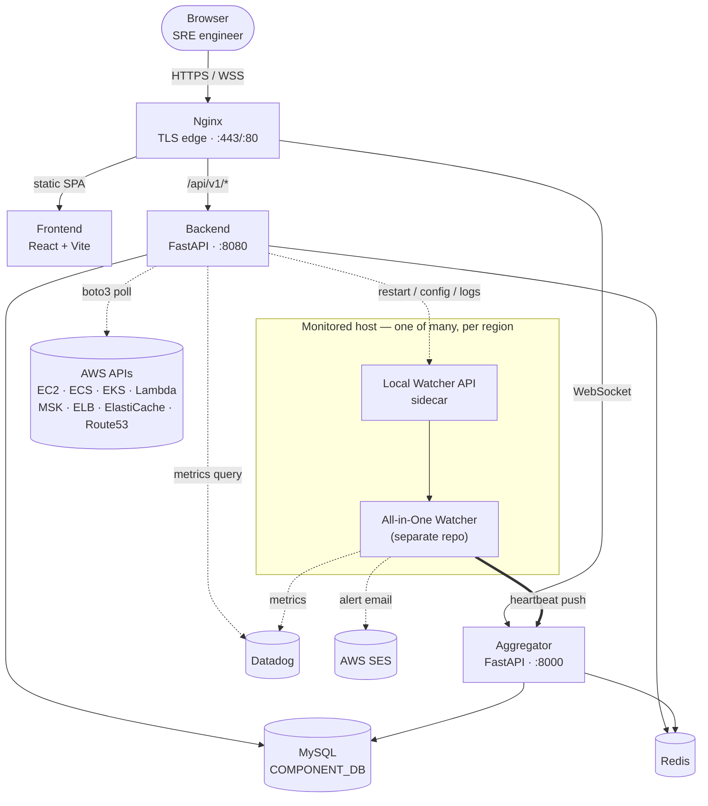

# Atlas Dashboard

A full-stack SRE/operations dashboard for monitoring and managing multi-region AWS
infrastructure from a single pane of glass. Built to replace scattered manual checks
across the AWS console, CLI, and spreadsheets with one real-time, role-based web app.

**🔗 [Live demo](https://ashankaushanka96.github.io/operations-dashboard/)** — a
static build running entirely on mock data (no backend/AWS account behind it), so
you can click through every section without any setup.

## Overview

Atlas Dashboard gives an SRE/ops team live visibility into EC2 fleets, managed AWS
services, DNS failover, and the internal "watcher" agents deployed on each host —
plus the ability to act on what they see (start/stop instances, run scheduled
lambdas, restart components) without leaving the browser.

**Highlights:**

- **Multi-service AWS visibility** — EC2, ECS, EKS, Lambda, MSK, ElastiCache, Load
  Balancers, and Route 53 failover/health status, aggregated across regions.
- **Host & component tracking** — a lightweight "watcher" model reports server
  inventory, compliance status (via SSM + Inspector findings), and per-host
  component/process state, visualized as an interactive component tree.
- **EC2 scheduling** — tag-driven start/stop schedules with a weekly calendar view,
  backed by EventBridge rules and a scheduler Lambda.
- **Real-time updates** — a WebSocket-driven aggregator service pushes live status
  and desktop-style notifications to connected clients instead of relying on polling.
- **Authentication & RBAC** — Microsoft Entra ID (Azure AD) SSO via OIDC/JWT, local
  username/password auth, and API-key auth for service-to-service calls, with
  role-based permissions (admin/feedops/developer/viewer).
- **Datadog metrics integration** for host-level charts alongside AWS data.

## Architecture

Five pieces ship together behind a single Nginx TLS edge via `docker-compose`; a
sixth — the host agent — is a separate project deployed independently onto every
monitored server, so it's diagrammed here but isn't part of this repo's compose
stack.



📎 **[Interactive architecture diagram](https://ashankaushanka96.github.io/operations-dashboard/architecture.html)** ([source](docs/architecture.html)) — hover or tab through any component to trace its connections.

**Edge & client**
- **Browser** — the SRE engineer's session. Never talks to Backend or Aggregator
  directly, only through Nginx over HTTPS/WSS.
- **Nginx** (`nginx:alpine`) — the single TLS-terminating entry point. Redirects
  :80→:443, then routes by path: the static app to Frontend, the live component
  WebSocket to Aggregator, and everything under `/api/v1/*` to Backend.

**Application services**
- **`frontend/`** — React 19 + Vite SPA (MUI, D3, framer-motion): Home, Component
  DB, the live Component Map, Host Details, AWS Resources, EC2 Schedules, Route 53,
  Server Handler, Watcher Status, Pipelines. Pulls REST data from Backend and opens
  a same-origin WebSocket straight through to Aggregator for live status.
- **`backend/`** — FastAPI (`:8080`), the main API and control plane. The *only*
  service that talks to AWS and Datadog: authentication, the component DB/tree,
  EC2 schedules and start/stop, Route 53, live read-through summaries for
  EC2/ECS/EKS/Lambda/MSK/Redis/load-balancers/ElastiCache (via boto3, cached in
  Redis), Datadog metric queries, and **Watcher Control** — driving each host's
  Local Watcher API to restart processes, edit `config.ini`, and tail/grep/download
  logs.
- **`aggregator/`** — FastAPI (`:8000`), the ingest side that makes this a
  monitoring system rather than just a dashboard. Receives a status push from every
  host's Watcher agent, maintains the live component tree in MySQL, and fans it
  back out over the `/component/ws-component-details` WebSocket. Kept apart from
  Backend so a noisy live-update loop can't affect the main API, and it never talks
  to AWS or Datadog itself.

**Data stores**
- **`mysql/` — MySQL `COMPONENT_DB`** — shared system of record for Backend and
  Aggregator: components, EC2 schedules, users/roles, the watcher-control audit
  trail, table preferences.
- **Redis** — shared cache in front of AWS API calls, schedules, and component
  summaries, so the dashboard isn't re-polling AWS on every page load.

**Fleet agent — runs on every monitored host** *(a separate project, not part of
this compose stack)*
- **All-in-One Watcher** — a Python agent driven by that host's own `config.ini`.
  Checks each configured process is running and restarts it if `needToUp` is set,
  tracks CPU/memory/uptime/log-directory size/port availability, pushes a status
  snapshot to the Aggregator every cycle, and on failure emails an alert via AWS SES.
- **Local Watcher API** — a small, API-key-authenticated FastAPI sidecar the agent
  exposes so Backend's Watcher Control section can act on it remotely: start/stop/
  restart the watcher or a single component, rewrite `config.ini` (with rollback to
  the last backup), and tail/page/grep/download a component's logs — including a
  live `tail -f` over WebSocket.

**External integrations**
- **AWS APIs** (boto3) — polled live by Backend only, then cached in Redis.
- **Datadog** — receives metrics pushed by every Watcher agent; Backend separately
  queries Datadog to surface configured charts on the dashboard.
- **AWS SES** — outbound relay the Watcher agent uses to email an alert when a
  monitored process is down and `needToSendMail` is enabled.

## Tech Stack

| Layer | Technology |
|---|---|
| Frontend | React 19, Vite, MUI, D3, MSAL (Entra SSO), WebSockets |
| Backend | Python, FastAPI, Uvicorn/Gunicorn, boto3, python-jose, passlib |
| Data | MySQL (connection-pooled), Redis |
| Infra | Docker & Docker Compose, Nginx, Ansible, GitLab CI/CD |
| Cloud | AWS (EC2, ECS, EKS, Lambda, MSK, ElastiCache, ELB, Route 53, SSM, Inspector, Secrets Manager, SES), Datadog |

## Local Setup

```bash
docker compose up -d
```

This brings up MySQL, Redis, the backend API, the aggregator, the frontend, and an
Nginx TLS terminator. See `docker-compose.dev.yml` for a hot-reload development
variant and `frontend/.env.example` / `backend/config/config.yaml` for the
configuration surface (all values below are placeholders — supply your own AWS
account, Entra tenant, and database credentials).

## MySQL DB Installation

```bash
docker run --name mysql-container -e MYSQL_ROOT_PASSWORD=password -d -p 3306:3306 mysql:latest
```
