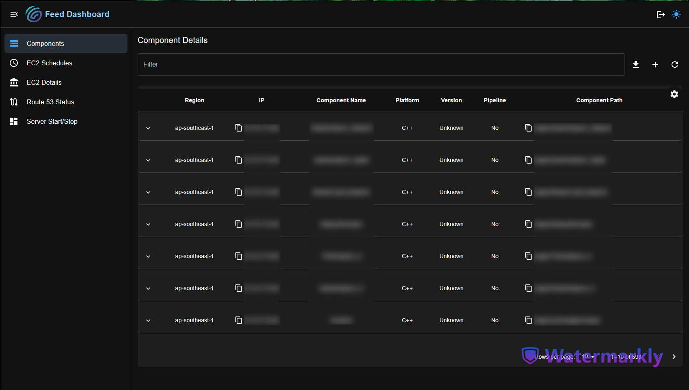
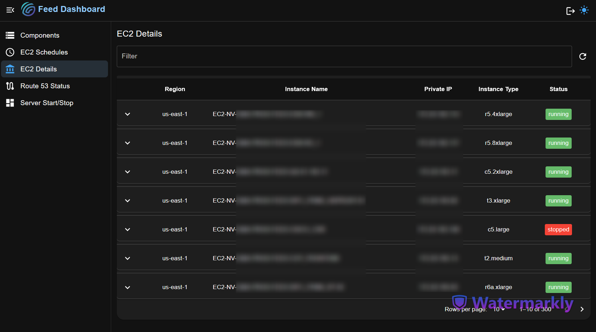
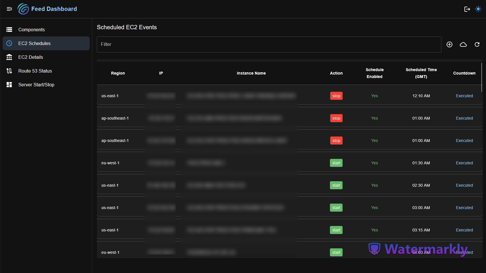
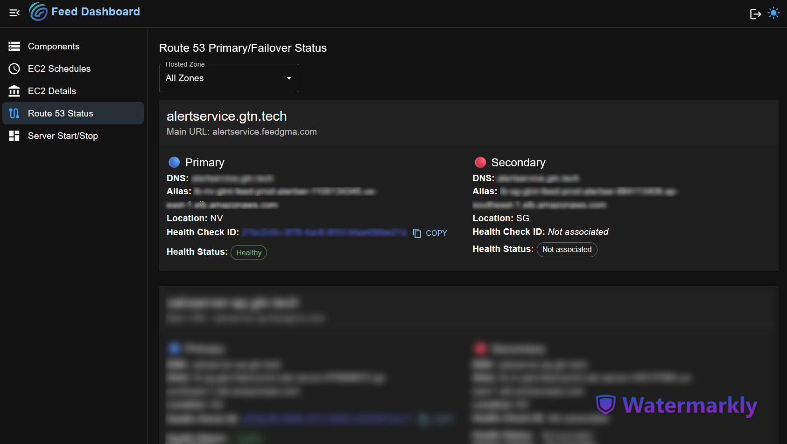
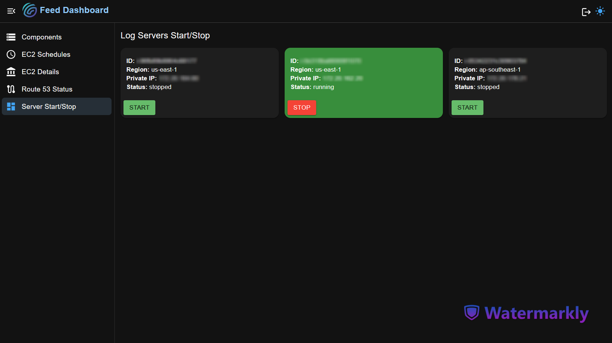

# Operations Dashboard

An end-to-end solution to monitor, visualize, and manage your operations infrastructure. This repository combines Ansible playbooks for automated provisioning, a Python API backend for data collection and processing, and a React frontend for interactive dashboards.

## 🚀 Features

- **Real-time Health Monitoring**: Continuously check the status and availability of servers and services.
- **Metrics Visualization**: Interactive charts and tables to display CPU, memory, network, and custom metrics.
- **Log Aggregation**: Fetch and display logs for quick troubleshooting.
- **Automated Deployment**: Use Ansible playbooks to provision and configure infrastructure consistently.
- **CI/CD Integration**: GitLab CI pipeline for automated testing and deployment.

## 🏛️ Architecture

```
┌──────────────┐      ┌───────────────────┐      ┌───────────────┐
│   Frontend   │ <--► │     Backend       │ <--► │   Data Store  │
│ (React App)  │      │ (FastAPI / Flask) │      │ (Database /   │
└──────────────┘      └───────────────────┘      │   Metrics)    │
                                                 └───────────────┘
      ▲
      │
      ▼
┌──────────────┐
│   Ansible    │
│ Playbooks &  │
│   Roles      │
└──────────────┘
```

## 📁 Repository Structure

```
operations-dashboard/
├── ansible/             # Ansible playbooks and roles
├── backend/             # Python API (FastAPI/Flask)
│   ├── app/             # Application source code
│   ├── requirements.txt
│   └── main.py
├── frontend/            # React dashboard application
│   ├── src/
│   ├── public/
│   └── package.json
├── .gitlab-ci.yml       # GitLab CI pipeline configuration
└── README.md            # This file
```

## ⚙️ Prerequisites

- **Python 3.8+**
- **Node.js 14+ & npm**
- **Ansible 2.9+**
- **Docker & Docker Compose** (optional, for containerized runs)

## 🛠️ Local Setup

1. **Clone the repository**

   ```bash
   git clone https://github.com/ashankaushanka96/operations-dashboard.git
   cd operations-dashboard
   ```

2. **Backend Setup**

   ```bash
   cd backend
   python -m venv venv
   source venv/bin/activate         # Linux/macOS
   venv\Scripts\activate          # Windows
   pip install -r requirements.txt
   uvicorn main:app --reload --host 0.0.0.0 --port 8000
   ```

3. **Frontend Setup**

   ```bash
   cd ../frontend
   npm install
   npm start
   ```

4. **Access the Dashboard**
   - Frontend: `http://localhost:3000`
   - API: `http://localhost:8000/api`

## 📦 Deployment with Ansible

Customize `ansible/inventory` with your hosts, then:

```bash
cd ansible
ansible-playbook site.yml -i inventory
```

This will provision servers, deploy the backend API, and serve the frontend static assets.

## 🔄 CI/CD Pipeline

The `.gitlab-ci.yml` automates:

- **Lint & Test**: Runs Python and JavaScript linters, unit tests.
- **Build**: Dockerizes backend and frontend.
- **Deploy**: Pushes images to container registry and triggers Ansible for deployment.

Configure CI variables in GitLab for registry credentials and inventory settings.

## 🖼️ Screenshots

### Component Details Section



### EC2 Details Section



### EC2 Schedule Section



### Route53 Status Section



### Server Start Stop Section



## 📬 Contact

- **Maintainer**: Ashan Kaushanka
- **Email**: ashankaushanka96@example.com

---
